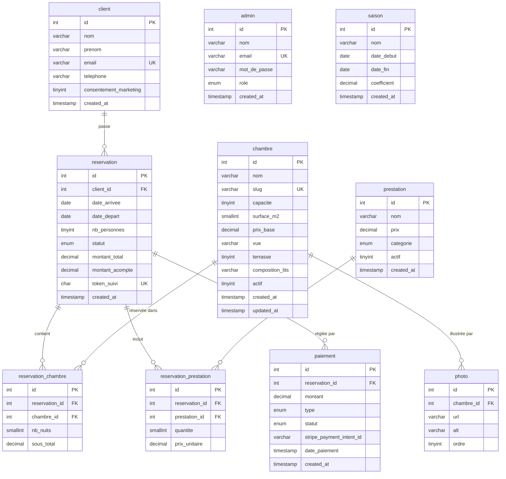

# Imsouane Surf Paradise

Application web full-stack de réservation pour un homestay surf à Imsouane (Maroc) : site vitrine, tunnel de réservation avec tarification saisonnière calculée nuit par nuit, paiement en deux temps (acompte + solde) et back-office d'administration avec contrôle d'accès par rôle.

Projet de soutenance — Titre Pro Développeur Web & Web Mobile (AFEC Bayonne) — conçu et développé en solo, et destiné à une mise en production réelle pour le commanditaire.

**Stack :** React 19 / Vite · Express 4 · MySQL (mysql2) · JWT · argon2 · Zod · Helmet · Nodemailer (Brevo SMTP) · Cloudinary (médias)

**En production :** front sur **Vercel** · API + base sur **AlwaysData** · images sur **Cloudinary** — [imsouane-surf-paradise.vercel.app](https://imsouane-surf-paradise.vercel.app)

---

## Sommaire

1. [Architecture](#1-architecture)
2. [Cycle de vie d'une requête](#2-cycle-de-vie-dune-requête)
3. [Modèle de données](#3-modèle-de-données)
4. [Logique métier — le moteur de devis](#4-logique-métier--le-moteur-de-devis)
5. [Intégrité & robustesse](#5-intégrité--robustesse)
6. [Sécurité](#6-sécurité)
7. [Paiement — simulation du flux Stripe](#7-paiement--simulation-du-flux-stripe)
8. [Référence API](#8-référence-api)
9. [Front-end](#9-front-end)
10. [Démarrage & déploiement](#10-démarrage--déploiement)
11. [Compromis assumés & évolutions](#11-compromis-assumés--évolutions)

---

## 1. Architecture

Application **découplée** : un front React (SPA) consomme une API REST Express. Pas de rendu serveur, communication exclusivement JSON. Les deux services se déploient indépendamment.

```
frontend/   React 19 + Vite · SCSS Modules · React Router 7
backend/    API REST Express · architecture MVC en couches
database/   schéma SQL complet (db.sql)
docs/       notes techniques (devis, modèle de réservation, flux paiement)
```

Le back-end suit une **architecture MVC en couches**, ordonnée par préfixe numérique pour que le flux d'une requête se lise dans l'ordre des dossiers :

```
backend/
├── 1_config/        connexion MySQL (pool mysql2/promise), transporter SMTP
├── 2_models/        accès données — SQL brut, requêtes préparées
├── 3_middlewares/   validation Zod · auth JWT · contrôle de rôle (RBAC)
├── 4_controllers/   logique métier
├── 5_routes/        endpoints + chaînage des middlewares
├── app.js           instance Express, middlewares globaux, montage des routes
└── server.js        bootstrap (écoute du port)
```

Chaque ressource (chambre, réservation, prestation, saison, paiement, auth) possède son quadruplet route / controller / model, et les routes sont préfixées `/api/<ressource>`.

---

## 2. Cycle de vie d'une requête

Une requête mutative traverse toujours la même chaîne, du plus générique au plus spécifique :

```
requête
  → app.js          express.json() · CORS (allowlist) · Helmet
  → route            /api/reservations
  → validation       schéma Zod (rejet 400 si payload invalide)
  → authMiddleware   vérifie le JWT, remplit req.user        [routes privées]
  → roleMiddleware   vérifie req.user.role ∈ rôles autorisés [routes privées]
  → controller       logique métier, orchestration
  → model            SQL préparé / transaction
  → MySQL
```

Les routes publiques (vitrine, estimation, création de réservation, suivi par token) sautent les deux middlewares d'auth ; les routes back-office les exigent.

---

## 3. Modèle de données

Schéma relationnel MySQL, intégrité garantie par les clés étrangères et les `ON DELETE CASCADE`. Les statuts et catégories sont contraints par des `ENUM` plutôt que des chaînes libres.



> `admin` et `saison` n'ont pas de clé étrangère : `admin` est isolée (back-office), `saison` est consommée par le moteur de devis sans relation rigide (chevauchement de périodes résolu en SQL au calcul).

| Table                    | Rôle                            | Points clés                                                           |
| ------------------------ | ------------------------------- | --------------------------------------------------------------------- |
| `client`                 | voyageurs (guest checkout)      | `email` **UNIQUE**, consentement marketing (RGPD)                     |
| `admin`                  | staff                           | `role` **ENUM**(`super_admin`,`admin`,`gestionnaire`), `email` UNIQUE |
| `chambre`                | les 7 hébergements              | `slug` UNIQUE (URL lisible)                                           |
| `photo`                  | images d'une chambre            | FK `chambre_id` **ON DELETE CASCADE** · `url` = lien **Cloudinary**    |
| `saison`                 | périodes tarifaires             | `coefficient` appliqué au prix de base                                |
| `prestation`             | options payantes                | `categorie` **ENUM**(`menage`,`pack_surf`,`autre`) — table unifiée    |
| `reservation`            | un séjour                       | `statut` **ENUM**, `token_suivi` UNIQUE, FK `client_id`               |
| `reservation_chambre`    | liaison N..M résa ↔ chambres    | **UNIQUE**(`reservation_id`,`chambre_id`), `sous_total` **figé**      |
| `reservation_prestation` | liaison N..M résa ↔ prestations | `prix_unitaire` figé à la commande                                    |
| `paiement`               | transactions                    | `type` & `statut` ENUM, `stripe_payment_intent_id` (réservé)          |

### Machine à états d'une réservation

Le champ `reservation.statut` est un `ENUM` qui matérialise le cycle de vie :

```
en_attente ──(acompte confirmé)──> acompte_paye ──(solde confirmé)──> soldee
     │                                   │
     └──────────────(annulation)─────────┴──────────────> annulee
```

Les réservations `annulee` sont **exclues du contrôle de disponibilité** (la chambre se relibère automatiquement).

---

## 4. Logique métier — le moteur de devis

Le cœur du projet n'est pas l'affichage mais la **justesse du prix**. Toute la tarification passe par une unique fonction `calculerDevis`, partagée par deux usages :

- l'**estimation** (`POST /reservations/estimation`) — calcul live affiché dans le récap, sans rien écrire en base ;
- la **création** (`POST /reservations`) — le devis réel qui sera enregistré.

> Une seule source de vérité : le prix affiché et le prix facturé sont produits par le **même code**. Aucune divergence possible entre ce que le client voit et ce qu'il paie.

### Tarification saisonnière, nuit par nuit

Le total n'est pas une moyenne : chaque nuit est facturée `prix_base × coefficient` de **sa** saison, puis l'ensemble est sommé. Un séjour qui chevauche deux saisons est donc exact à la nuit près.

```
sous_total(chambre) = Σ  prix_base × coefficient(nuit)   pour chaque nuit du séjour
```

Si plusieurs saisons se recouvrent sur une même nuit, le **coefficient le plus élevé** l'emporte (règle de prudence tarifaire). Tous les montants sont arrondis au centime (`Math.round(x*100)/100`).

### Règle métier intégrée

Un ménage hebdomadaire est **inclus gratuitement** dès 8 nuits. Dans ce cas, toute ligne « ménage » payante envoyée par le front est **ignorée côté serveur** — on ne facture jamais une prestation déjà incluse.

### Décomposition acompte / solde

`montant_acompte = 30 % du total` · `montant_solde = total − acompte`, calculés côté serveur et stockés sur la réservation.

---

## 5. Intégrité & robustesse

Le code part d'un principe constant : **ne jamais faire confiance au client**, et **garantir l'état de la base même en cas d'incident**.

**Revalidation systématique côté serveur.** La capacité d'accueil (Σ capacités des chambres ≥ nombre de voyageurs) est revérifiée à la création même si le front applique déjà la règle. Au paiement, le montant est **relu en base**, jamais accepté depuis la requête.

**Prix figé (snapshot).** Le `sous_total` de chaque chambre et le `prix_unitaire` de chaque prestation sont gelés sur les lignes de réservation au moment de la commande. Si les tarifs évoluent ensuite, l'historique reste fidèle au prix réellement payé.

**Création transactionnelle.** Une réservation engage 4 types d'écritures (client, réservation, lignes chambres, lignes prestations). Le tout est encapsulé dans une **transaction** avec `commit` final et `rollback` sur toute erreur : jamais de réservation à moitié écrite. La connexion est systématiquement libérée (`finally → conn.release()`).

**Disponibilité anti-chevauchement.** Au sein de la transaction, chaque chambre est contrôlée par une détection de recouvrement de périodes :

```sql
WHERE chambre_id = ?
  AND statut <> 'annulee'
  AND date_arrivee < :date_depart   -- la résa existante commence avant la fin demandée
  AND date_depart  > :date_arrivee   -- et finit après le début demandé
```

Un conflit renvoie un **`409 Conflict`** explicite identifiant la chambre concernée.

**Confirmation de paiement idempotente.** Le passage d'un paiement à `reussi` est gardé par `... WHERE id = ? AND statut <> 'reussi'`. Un webhook rejoué (double notification) ne déclenche donc pas deux fois le traitement.

**Isolation des effets de bord.** L'envoi de l'email de confirmation est dans un **try/catch dédié** : si le SMTP échoue, le paiement reste validé et seul un log est émis — un email raté ne casse jamais une transaction métier.

---

## 6. Sécurité

Défense en profondeur, à chaque couche :

| Couche            | Mesure                                                                                                                                                                            |
| ----------------- | --------------------------------------------------------------------------------------------------------------------------------------------------------------------------------- |
| Validation        | Schémas **Zod** en entrée des routes mutatives — rejet `400` avant tout traitement                                                                                                |
| Authentification  | **JWT** signé (`JWT_SECRET`, expiration configurable), vérifié par `authMiddleware` qui peuple `req.user`                                                                         |
| Autorisation      | **RBAC** à 3 rôles via `roleMiddleware(...roles)`, appliqué après l'auth ; granularité par route (ex. écriture chambre = `super_admin`/`admin` ; consultation résa = les 3 rôles) |
| Mots de passe     | Hachage **argon2** (recommandation OWASP) ; vérification par `argon2.verify`                                                                                                      |
| Base de données   | **Requêtes préparées** partout (mysql2) — aucune concaténation SQL                                                                                                                |
| HTTP              | En-têtes durcis via **Helmet** ; **CORS** restreint à une allowlist d'origines (`.env`) avec `credentials`                                                                        |
| Inscription admin | `register` réservé au `super_admin` — pas d'auto-enregistrement public                                                                                                            |
| Paiement          | Montant **relu en base**, jamais transmis par le client                                                                                                                           |

> Le `ProtectedRoute` côté React ne protège que **l'affichage** (confort UX). La sécurité réelle repose entièrement sur les middlewares API, qui refusent toute donnée sans JWT valide et rôle suffisant. Le commentaire est explicite dans le code : « on ne fait jamais confiance au front ».

---

## 7. Paiement — simulation du flux Stripe

Le paiement (acompte 30 % puis solde) est implémenté comme une **simulation fidèle du modèle Stripe**, sans dépendance externe — un choix assumé et documenté, qui isole proprement le point de branchement réel :

| Étape simulée                                                                        | Équivalent Stripe réel                                     |
| ------------------------------------------------------------------------------------ | ---------------------------------------------------------- |
| `POST /paiements/acompte/:id` → crée une ligne `paiement` + référence `SIMU-<uuid>`  | Création d'un `PaymentIntent` / `Checkout Session`         |
| Colonne `stripe_payment_intent_id` (déjà présente, stocke la référence)              | L'`id` Stripe réel                                         |
| `POST /paiements/:id/confirmer` → marque `reussi`, fait avancer le statut de la résa | **Webhook** Stripe (serveur→serveur, signature à vérifier) |

Passer à un vrai Stripe revient à remplacer ces deux points d'entrée — le reste de la logique métier (montants, statuts, email) ne bouge pas. La confirmation de l'acompte déclenche l'email récapitulatif (Brevo SMTP / Nodemailer) et fait passer la réservation en `acompte_paye`.

---

## 8. Référence API

Base : `/api` · Format : JSON

### Auth

| Méthode | Endpoint         | Accès                   |
| ------- | ---------------- | ----------------------- |
| POST    | `/auth/login`    | public → renvoie un JWT |
| POST    | `/auth/register` | privé · `super_admin`   |

### Chambres

| Méthode             | Endpoint                    | Accès                         |
| ------------------- | --------------------------- | ----------------------------- |
| GET                 | `/chambres`                 | public                        |
| GET                 | `/chambres/disponibles`     | public                        |
| GET                 | `/chambres/slug/:slug`      | public                        |
| GET                 | `/chambres/:id`             | public                        |
| POST · PUT · DELETE | `/chambres` `/chambres/:id` | privé · `super_admin`,`admin` |

> Ordre des routes maîtrisé : les routes littérales (`/disponibles`, `/slug/:slug`) sont déclarées **avant** `/:id`, sinon Express ferait correspondre `disponibles` au paramètre `:id`.

### Réservations

| Méthode | Endpoint                              | Accès                   |
| ------- | ------------------------------------- | ----------------------- |
| POST    | `/reservations/estimation`            | public (devis live)     |
| POST    | `/reservations`                       | public (guest checkout) |
| GET     | `/reservations/suivi/:token`          | public (lien email)     |
| GET     | `/reservations` · `/reservations/:id` | privé · 3 rôles         |
| PATCH   | `/reservations/:id/statut`            | privé · 3 rôles         |

### Paiements

| Méthode | Endpoint                                | Accès                      |
| ------- | --------------------------------------- | -------------------------- |
| POST    | `/paiements/acompte/:reservationId`     | public                     |
| POST    | `/paiements/total/:reservationId`       | public                     |
| POST    | `/paiements/:id/confirmer`              | public (simule le webhook) |
| GET     | `/paiements/reservation/:reservationId` | privé · 3 rôles            |

Plus `/saisons` et `/prestations` (lecture publique, écriture admin).

---

## 9. Front-end

- **React 19 + Vite** · **SCSS Modules** (styles scopés par composant, pas de fuite globale)
- **React Router 7** — routes publiques + zone admin sous `ProtectedRoute` (redirection si non connecté ou rôle insuffisant)
- **Contexts** : `AuthContext` (session admin + token), `ReservationContext` (état du tunnel partagé entre les étapes)
- **Hooks dédiés** : `useReservation`, `useAuth`, `useRevealAuScroll` (animations à l'Intersection Observer)
- **Instance axios unique** pré-configurée (`baseURL` via `VITE_API_URL`) — point d'entrée unique vers l'API, pas d'URL en dur dispersée
- Sélection de dates : `react-day-picker` + `date-fns`
- Composants notables : tunnel (`SelecteurSejour`, `RecapSejour`), `Lightbox`, `Seo`, dashboard admin

Parcours : `Accueil → Hébergement → DetailChambre → Reservation → Paiement → Confirmation`, plus `/admin/login` et `/admin/dashboard`.

---

## 10. Démarrage & déploiement

### Pré-requis

Node.js 18+ · MySQL 8

### Base de données

```bash
mysql -u root -p < database/db.sql
```

### Back-end

```bash
cd backend
npm install
cp .env.example .env      # renseigner les variables ci-dessous
npm run dev               # http://localhost:3000  (health: /api/health)
```

Variables `.env` (back) :
`PORT` · `DB_HOST` · `DB_USER` · `DB_PASS` · `DB_NAME` · `CORS_ORIGIN` (origines séparées par virgule) · `JWT_SECRET` · `JWT_EXPIRES_IN` · `BREVO_SMTP_HOST` · `BREVO_SMTP_PORT` · `BREVO_SMTP_USER` · `BREVO_SMTP_PASS` · `MAIL_FROM` · `FRONTEND_URL`

### Front-end

```bash
cd frontend
npm install
npm run dev               # http://localhost:5173
```

Variables `.env` (front) :
- `VITE_API_URL` — base de l'API (ex. `http://localhost:3000/api`)
- `VITE_CLOUDINARY_CLOUD` — *cloud name* Cloudinary servant les images (repli `dsepfzneu` si absent)

### Déploiement (production)

Les deux services et les médias sont hébergés séparément :

| Brique        | Hébergeur                          | Notes                                                                 |
| ------------- | ---------------------------------- | --------------------------------------------------------------------- |
| Front (SPA)   | **Vercel** (CDN edge)              | build Vite ; `vercel.json` réécrit toutes les routes vers `index.html` (React Router) |
| API + base    | **AlwaysData** (site Node.js)      | serveur Express persistant + MySQL **sur le même hôte** (UE / RGPD)    |
| Images        | **Cloudinary**                     | `public_id` = chemin `imsouane/<dossier>/<fichier>`, livraison `f_auto,q_auto` |

**Images Cloudinary.** Les photos réelles sont optimisées (bord long ≤ 3000 px, JPEG q88) puis uploadées en imposant le `public_id` = chemin exact, de sorte que les URLs en base (`photo.url`) et le front (`Accueil.jsx`) restent stables. `f_auto,q_auto` = format moderne (WebP/AVIF) et compression servis automatiquement selon le navigateur.

**CORS.** En prod, `CORS_ORIGIN` liste les origines autorisées séparées par virgule (ex. `http://localhost:5173,https://imsouane-surf-paradise.vercel.app`) ; le front Vercel appelle l'API via `VITE_API_URL=https://maxime-garin.alwaysdata.net/api`.


### Scripts utiles

- `backend/` : `npm run dev` (nodemon) · `npm start` · `npm run test:erreurs`
- `frontend/` : `npm run dev` · `npm run build` · `npm run preview` · `npm run lint`

---

## 11. Compromis assumés & évolutions

**SEO (SPA).** Vite génère un rendu client : le SEO est structurellement plus faible qu'un rendu serveur. Mitigation prévue en fin de parcours (meta par page, pré-rendu des pages vitrine). Choix assumé : le cœur de valeur est le tunnel de réservation, pas l'indexation.

**Paiement.** Simulation documentée du flux Stripe (cf. §7) — branchement réel prévu sur deux points d'entrée isolés.

**Comptes voyageurs.** Volontairement absents (guest checkout + token de suivi). Le schéma `client` prévoit déjà le terrain (`password_hash`, `email_verifie`) pour les ajouter sans rupture.

**Roadmap technique** : i18n (FR/EN/DE via react-i18next, clientèle surf internationale), tarification saisonnière éditable en back-office, packs surf (déjà prévus dans la table `prestation` unifiée).

---

## Auteur

**Maxime Garin** — [github.com/maximegarin](https://github.com/maximegarin)
#
